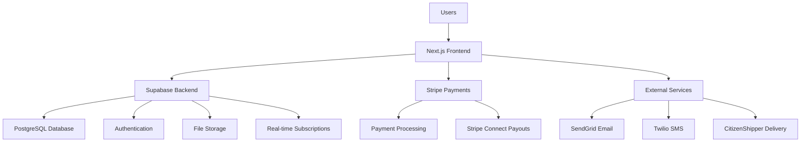
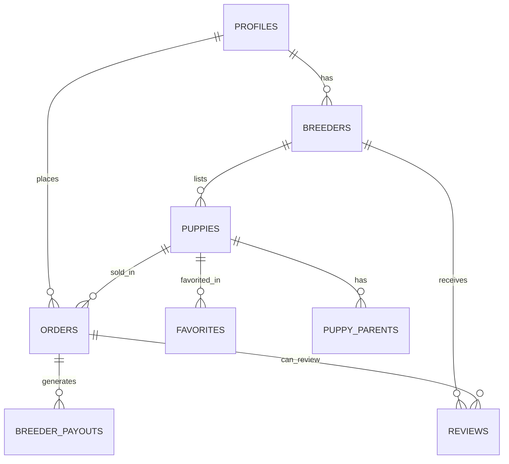

# HonestPup Platform Design

## Overview

The HonestPup platform is designed as a modern, mobile-first web application that prioritizes transparency, trust, and user experience. The architecture follows a serverless approach using Next.js 14 with Supabase as the backend-as-a-service, ensuring scalability, security, and rapid development.

The design emphasizes ethical business practices through transparent pricing, fast payments, and verified breeder networks, while providing an intuitive user experience for families seeking puppies.

## Architecture

### High-Level Architecture



### Technology Stack

**Frontend Layer:**
- Next.js 14 with App Router for server-side rendering and optimal performance
- TypeScript for type safety and developer experience
- Tailwind CSS with shadcn/ui for consistent, accessible component library
- React Hook Form with Zod validation for robust form handling

**Backend Layer:**
- Supabase PostgreSQL for primary data storage with Row Level Security
- Supabase Auth for user authentication and session management
- Supabase Storage for image and document uploads
- Supabase Edge Functions for serverless business logic

**Payment Layer:**
- Stripe for secure payment processing and PCI compliance
- Stripe Connect for marketplace payouts to breeders
- Affirm integration via Stripe for financing options

**Infrastructure:**
- Vercel for hosting and edge deployment
- Cloudflare CDN for global content delivery
- GitHub Actions for CI/CD pipeline

## Components and Interfaces

### Core Components

#### 1. User Management System

**Authentication Component:**
- Supabase Auth integration with email/password and OAuth providers
- Role-based access control (buyer, breeder, admin)
- Guest checkout capability for buyers
- Session management with automatic refresh

**Profile Management:**
- Unified profile system extending Supabase auth.users
- Role-specific profile extensions (breeder business info, admin permissions)
- Profile verification workflows for breeders

#### 2. Puppy Listing System

**Listing Management:**
- Rich media support (photos, videos) with automatic optimization
- Comprehensive puppy information (breed, health, parents, pricing)
- Status management (draft, available, reserved, sold)
- SEO-friendly URLs and metadata

**Search and Discovery:**
- Advanced filtering with real-time updates
- Location-based search with radius support
- Breed-specific categorization and characteristics
- Favorites and comparison functionality

#### 3. Transaction Processing

**Checkout Flow:**
- Three-step checkout process (contact, delivery, payment)
- Guest checkout with optional account creation
- Real-time price calculation including delivery fees
- Multiple payment methods (card, financing)

**Order Management:**
- Order lifecycle tracking (pending → confirmed → shipped → delivered)
- Automated email and SMS notifications
- Delivery coordination with external partners
- 48-hour refund window management

#### 4. Breeder Portal

**Business Dashboard:**
- Sales analytics and performance metrics
- Payout tracking and financial reporting
- Listing management with bulk operations
- Customer communication tools

**Listing Tools:**
- Individual listing creation with rich media upload
- CSV bulk upload for multiple puppies
- Inventory management with calendar integration
- Pricing and availability management

#### 5. Administrative Interface

**Platform Management:**
- Breeder application review and verification
- Content moderation and quality control
- Financial oversight and dispute resolution
- Platform analytics and reporting

### API Design

**RESTful Endpoints:**
```typescript
// Public API
GET /api/puppies - Search and filter puppies
GET /api/puppies/[id] - Get puppy details
GET /api/breeders/[id] - Get breeder profile

// Authenticated API
POST /api/orders - Create new order
GET /api/orders/[id] - Get order details
POST /api/favorites - Add/remove favorites

// Breeder API
POST /api/breeder/puppies - Create puppy listing
PUT /api/breeder/puppies/[id] - Update listing
GET /api/breeder/analytics - Get sales data

// Admin API
GET /api/admin/applications - Get pending applications
POST /api/admin/applications/[id]/approve - Approve breeder
GET /api/admin/platform-metrics - Get platform statistics
```

**Real-time Subscriptions:**
- Order status updates via Supabase Realtime
- New message notifications
- Payout status changes
- Platform announcements

## Data Models

### Core Entities

#### User Profiles
```typescript
interface Profile {
  id: string;
  email: string;
  full_name: string;
  phone?: string;
  role: 'buyer' | 'breeder' | 'admin' | 'support';
  avatar_url?: string;
  created_at: string;
  updated_at: string;
}
```

#### Breeder Business
```typescript
interface Breeder {
  id: string;
  user_id: string;
  business_name: string;
  legal_name: string;
  address: Address;
  usda_license_number?: string;
  years_in_business?: number;
  status: 'pending' | 'approved' | 'suspended' | 'rejected';
  breeds: string[];
  certifications: string[];
  policies: BreederPolicies;
  stripe_account_id?: string;
  stats: BreederStats;
}
```

#### Puppy Listings
```typescript
interface Puppy {
  id: string;
  breeder_id: string;
  name: string;
  breed: string;
  gender: 'male' | 'female';
  birth_date: string;
  color: string;
  price: number;
  status: 'draft' | 'available' | 'reserved' | 'sold' | 'unavailable';
  ready_date: string;
  health_records: HealthRecord[];
  photos: string[];
  video_url?: string;
  description: string;
  personality_traits: string[];
  parents: PuppyParent[];
}
```

#### Orders and Transactions
```typescript
interface Order {
  id: string;
  order_number: string;
  user_id?: string; // Optional for guest checkout
  puppy_id: string;
  breeder_id: string;
  buyer_info: BuyerInfo;
  pricing: OrderPricing;
  payment: PaymentInfo;
  delivery: DeliveryInfo;
  status: OrderStatus;
  refund_eligible_until: string;
}
```

### Relationships



## Error Handling

### Client-Side Error Handling

**Form Validation:**
- Real-time validation using Zod schemas
- User-friendly error messages with specific guidance
- Accessibility-compliant error announcements

**Network Error Handling:**
- Automatic retry for transient failures
- Offline state detection and messaging
- Graceful degradation for slow connections

**Payment Error Handling:**
- Stripe-specific error message mapping
- Clear guidance for common payment issues
- Fallback payment method suggestions

### Server-Side Error Handling

**Database Errors:**
- RLS policy violation handling
- Connection timeout recovery
- Transaction rollback on failures

**External Service Errors:**
- Payment processor downtime handling
- Email/SMS delivery failure recovery
- File upload error management

**Security Error Handling:**
- Rate limiting with clear messaging
- Authentication failure redirects
- Authorization error responses

## Testing Strategy

### Unit Testing
- Component testing with React Testing Library
- Business logic testing with Jest
- Database function testing with Supabase test client
- Payment integration testing with Stripe test mode

### Integration Testing
- End-to-end user flows with Playwright
- API endpoint testing with Supertest
- Database integration testing
- Payment flow testing with test cards

### Performance Testing
- Core Web Vitals monitoring
- Database query performance testing
- Image optimization validation
- Mobile performance testing

### Security Testing
- RLS policy validation
- Authentication flow testing
- Input sanitization verification
- Payment security compliance testing

## Deployment and Scaling

### Development Environment
- Local development with Supabase CLI
- Environment variable management
- Hot reloading and fast refresh
- Database migration management

### Staging Environment
- Preview deployments on Vercel
- Staging database with production-like data
- Payment testing with Stripe test mode
- Performance monitoring setup

### Production Environment
- Multi-region deployment via Vercel Edge
- Database connection pooling
- CDN optimization for static assets
- Real-time monitoring and alerting

### Scaling Considerations
- Database read replicas for high traffic
- Image optimization and lazy loading
- API rate limiting and caching
- Horizontal scaling via serverless functions

## Security Architecture

### Authentication Security
- JWT token management with automatic refresh
- Multi-factor authentication for admin accounts
- Session timeout and concurrent session limits
- OAuth integration with trusted providers

### Data Security
- Row Level Security (RLS) for all database access
- Encrypted storage for sensitive data
- PCI compliance through Stripe integration
- Regular security audits and penetration testing

### API Security
- Rate limiting per user and IP
- Input validation and sanitization
- CORS configuration for trusted domains
- API key management for external services

### Infrastructure Security
- HTTPS enforcement with HSTS headers
- Content Security Policy (CSP) implementation
- Regular dependency updates and vulnerability scanning
- Backup encryption and secure storage

## Monitoring and Analytics

### Application Monitoring
- Real-time error tracking with Sentry
- Performance monitoring with Vercel Analytics
- Database performance monitoring
- API response time tracking

### Business Analytics
- User behavior tracking with privacy compliance
- Conversion funnel analysis
- Breeder performance metrics
- Financial transaction monitoring

### Operational Metrics
- System uptime and availability
- Database connection health
- Payment processing success rates
- Email/SMS delivery rates

This design provides a comprehensive foundation for building the HonestPup platform while maintaining flexibility for future enhancements and scaling requirements.